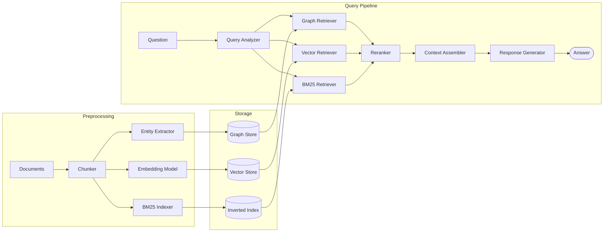

# Knowledge Graph Augmented RAG vs Traditional RAG

A benchmark study evaluating whether adding a Knowledge Graph retrieval layer meaningfully improves factual question answering over vector-only RAG, and under what conditions.

---

## Motivation

Traditional RAG relies on semantic similarity — it finds chunks that *look like* the query. This works well for single-hop factual questions but degrades on multi-hop reasoning where the answer must be assembled across multiple relationships. Knowledge Graph retrieval explicitly encodes entity relationships and can traverse them deterministically.

This project benchmarks both approaches on a structured dataset designed to stress-test multi-hop retrieval, disambiguation, and relationship traversal.

---

## Scope & Non-Goals

**In scope:**
- Knowledge Graph RAG vs vector-only RAG for factual question answering
- Hybrid retrieval combining vector + BM25 + graph traversal
- Evaluation of individual pipeline components

**Out of scope:**
- Microsoft GraphRAG (community detection + summary aggregation) — designed for thematic/global questions, not factual retrieval
- Production deployment, latency optimization

---

## Synthetic Dataset

Generated using LLM with structured prompts. Domain: Vietnamese tech company internal knowledge base.

**Entities:**
- 50 employees
- 8 departments
- 15 projects
- 30 skills
- 20 incidents

**Language:** Mixed Vietnamese and English (reflects real-world Vietnamese tech company documents)

**Two representations of the same data:**
- `data/json/` — structured ground truth used for graph construction and eval
- `data/plaintext/` — 93 plain text documents (employee profiles, project wikis, incident reports, department overviews) used as RAG input

The plain text was generated from JSON to simulate realistic document retrieval conditions — relationships are implicit in narrative text, not exposed as structured fields.

---

## Benchmark Questions

30 questions with ground truth answers, designed to test retrieval difficulty:

| Type | Count | Description | Key indicator |
|------|-------|-------------|---------------|
| Single-hop | 8 | Single entity lookup | Baseline — both approaches should handle |
| Two-hop | 10 | Traverse 2 relationships | Where graph starts to differentiate |
| Three-hop | 8 | Traverse 3+ relationships | Primary stress test for graph traversal |
| Ambiguous | 4 | 2 employees named "Nguyễn Văn Minh" | Tests entity disambiguation |

**Questions to watch closely:**
- `q_022` — cùng manager traversal: requires finding employees sharing a manager then finding their projects. Clearest differentiator between graph and vector.
- `q_020` — three-hop via reviewer: requires traversing manager → project → member role. Tests incomplete text coverage in plain text docs.
- `q_027/028/029` — ambiguous Nguyễn Văn Minh: same name, different department, different skills, different manager.

---

## Architecture



---

## Components & Variants

Each component has multiple implementation variants. The benchmark runs all combinations to isolate where each choice matters.

### Chunking
| Variant | Rationale |
|---------|-----------|
| Heading-based | Natural semantic boundaries for this dataset. Best case for structured docs. |
| Sliding window | Realistic baseline for unstructured input — most real-world docs cannot be heading-chunked. |

### Embedding
Multiple models tested to evaluate dimension size vs. language specificity trade-off:
- Large dimension general model
- Small dimension general model
- Vietnamese-optimized model (mixed-language data makes this relevant)

### Data → Graph Strategy
LLM-based extraction from plain text only — not from JSON directly. Reason: JSON extraction is unrealistic (real-world docs are not pre-structured). The JSON exists only as ground truth for evaluation.

Extraction quality itself is evaluated separately as it upstream-affects all graph retrieval results.

### Graph Traversal
| Variant | Rationale |
|---------|-----------|
| BFS fixed depth | Simple baseline. High recall, high noise. |
| Predefined patterns | Matches known query structures (manager lookup, project members, etc.). High precision for covered patterns. |
| LLM-generated Cypher | Flexible. Can handle novel patterns but risks syntax errors and hallucinated relationship names. |

### Reranking
| Variant | Rationale |
|---------|-----------|
| RRF (Reciprocal Rank Fusion) | No model required. Simple position-based merge of 3 source rankings. Baseline. |
| Cross-encoder | Reads question + passage jointly. More accurate but adds latency per candidate. |
| LLM-as-reranker | Most flexible. Offline eval only — too slow for interactive use. |

---

## Evaluation

### Graph Extraction Quality
Evaluated against JSON ground truth before running retrieval benchmarks. Upstream quality directly affects graph retrieval results.

- **Entity Precision** = correctly extracted entities / total extracted entities
- **Entity Recall** = correctly extracted entities / total ground truth entities
- **Relationship Precision** = correctly extracted relationships / total extracted relationships
- **Relationship Recall** = correctly extracted relationships / total ground truth relationships

### Retrieval Quality
- **Recall@5** = does the ground truth entity appear in the top 5 retrieved results?
- Measured per question type (single-hop / two-hop / three-hop / ambiguous)
- Measured per retrieval strategy (vector only / BM25 only / graph only / hybrid combinations)

### Answer Quality
LLM-as-judge with structured scoring:

```
Given:
  Question: {question}
  Ground truth: {ground_truth}
  System answer: {answer}

Score: CORRECT / PARTIAL / INCORRECT + one line reasoning
```

- Breakdown by question type
- Breakdown by component combination
- Source contribution analysis: which retrieval source was decisive?

### Latency
Average query time per strategy combination. Required to evaluate the accuracy/latency trade-off — a 4% accuracy gain may not justify 2x slower retrieval.

### Cost

LLM calls appeared in many steps of the pipeline:

| Component | LLM Usage | Cost Driver |
|-----------|-----------|-------------|
| Entity Extractor | Per document | Preprocessing — one-time cost |
| Query Analyzer | Per query | Runtime — scales với số queries |
| LLM-generated Cypher | Per query | Runtime — optional variant |
| LLM-as-reranker | Per query × candidates | Runtime — most expensive variant |
| LLM-as-judge | Per question | Eval only — offline |

**Metrics:**
- Total token usage per pipeline variant (preprocessing + query time)
- Cost per query at runtime (excluding one-time preprocessing)
- Cost/accuracy trade-off: so sánh accuracy gain với token cost tăng thêm khi thêm graph layer

---

## What We Expect to Learn

Primary question: **Under what conditions does Knowledge Graph augmentation improve over vector-only retrieval?**

Hypothesis going in:
- Single-hop: vector-only is sufficient, graph adds little
- Two-hop: hybrid starts outperforming vector-only
- Three-hop: graph traversal is decisive
- Ambiguous: graph provides cleaner entity disambiguation

If the hypothesis holds, the finding is not "graph is better" but "graph is worth it specifically for multi-hop relational queries on structured entity data." That's the nuanced, honest answer this benchmark is designed to produce.

---

## Known Limitations

- Synthetic data — does not capture full messiness of real-world documents (OCR errors, inconsistent naming, missing fields)
- 30 questions is a small sample — findings are directional, not statistically conclusive
- LLM extraction quality depends heavily on prompt quality — results reflect this specific prompt, not LLM extraction in general
- Single domain (company org structure) — graph advantage may not generalize to domains with sparser relationships
- Vietnamese + English mixed data may affect embedding model performance unpredictably